# 📖 Jomelle's Toys & Accessories: User Manual
**Technical Feature Breakdown & System Functionality**

This document provides a detailed look at the core functionalities of the Jomelle's Toys platform. Each feature is designed to ensure a secure, scalable, and user-friendly e-commerce experience.

---

### 🔐 1. Authentication & Security
The system implements a robust multi-portal authentication system to separate standard users from administrative staff.

* **Admin Portal:** Secure access for store managers to handle inventory and order fulfillment.
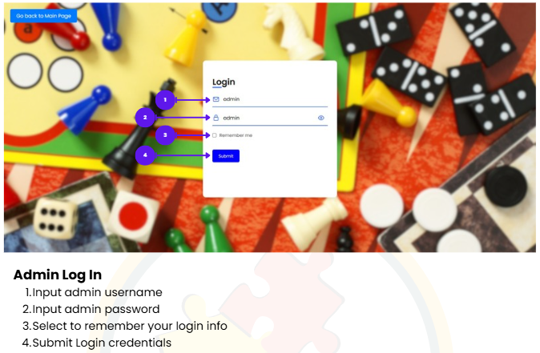

* **Customer Access:** Entry point for registered users to access personalized features.
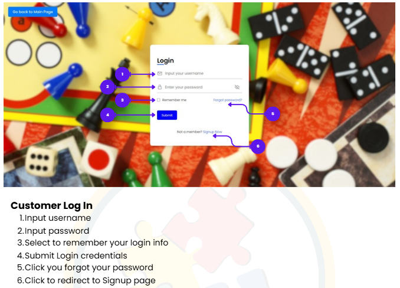

* **Account Creation:** Input-validated form for new user onboarding.
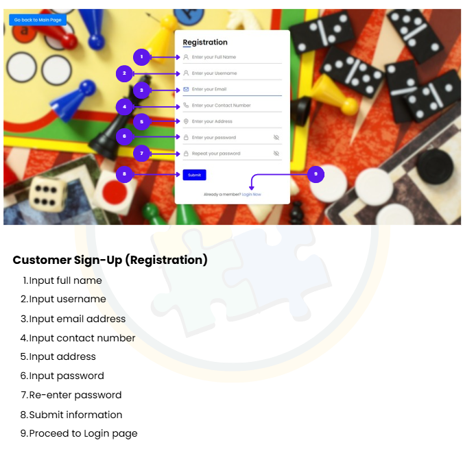

* **Credential Recovery:** Automated workflow to ensure users can safely regain account access.
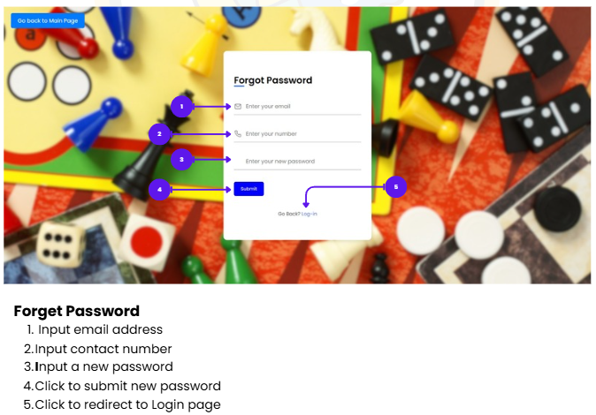

---

### 🏠 2. The User Interface (UX/UI)
Designed with high-discoverability in mind, the interface prioritizes product visuals and ease of navigation.

* **Main Landing:** Feature-rich landing pages showing seasonal promotions and top categories.
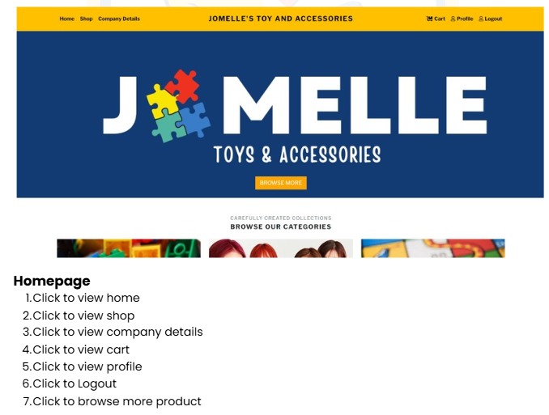
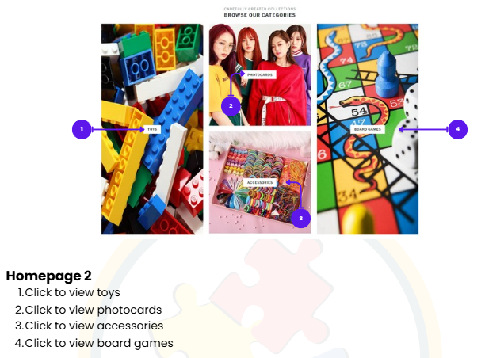

* **Thematic Assets:** Custom-branded visual elements that maintain consistent site identity.
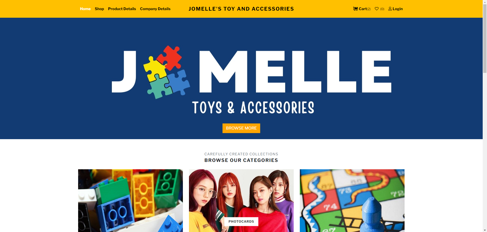

* **Corporate Transparency:** Static page providing brand history and contact information.
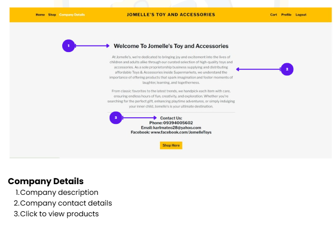

---

### 👤 3. Account & Profile Management
Users can maintain their data to ensure seamless shipping and communication.

* **Account Hub:** A centralized dashboard for users to manage their presence on the platform.
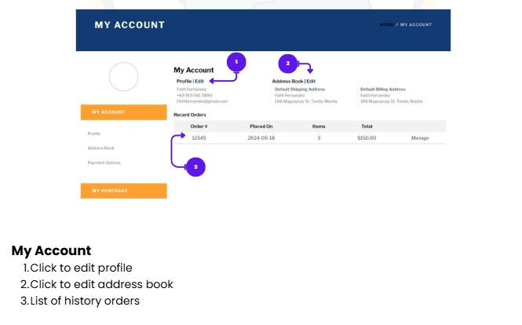

* **Data Persistence:** Interface for updating personal information, synchronized with the backend database.
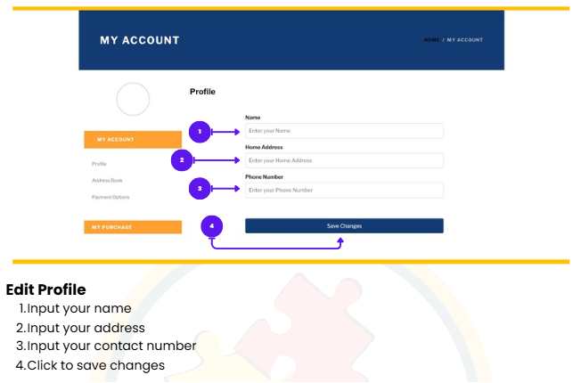

---

### 🛍️ 4. The E-Commerce Workflow
The "Heart" of the application—from product discovery to financial transaction.

* **Cataloging & Filtering:** Dynamic product grid with category-based filtering.
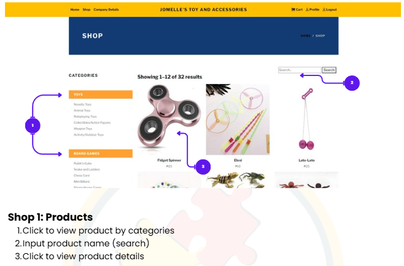
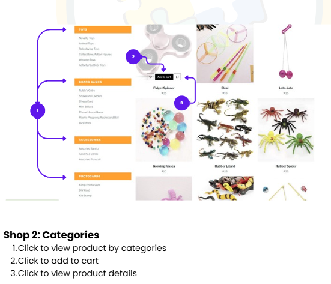

* **In-Depth View:** Detailed breakdown of product specs, pricing, and high-res imagery.

* **Inventory Management:** Real-time cart state that allows users to adjust quantities before purchase.
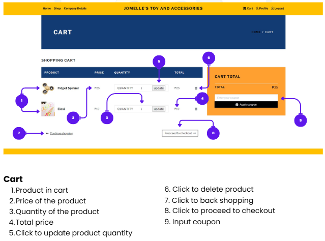

* **Transaction Flow:** A secure, multi-step checkout process with integrated payment method selection.
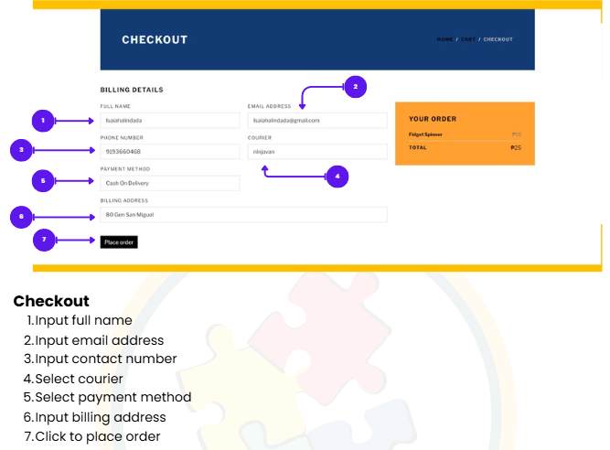
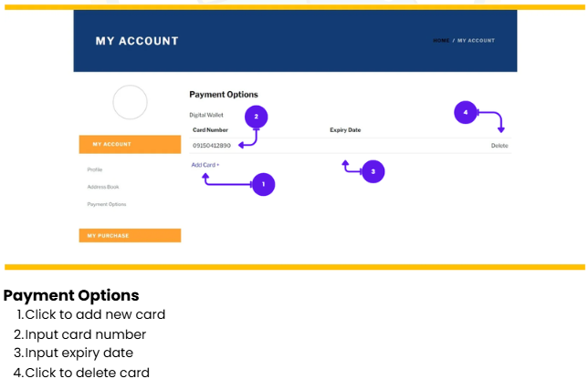

---

### 🧾 5. Order Management & Transparency
Post-purchase features that build user trust and record-keeping.

* **Historical Logs:** A dedicated section for users to track and review all previous transactions.
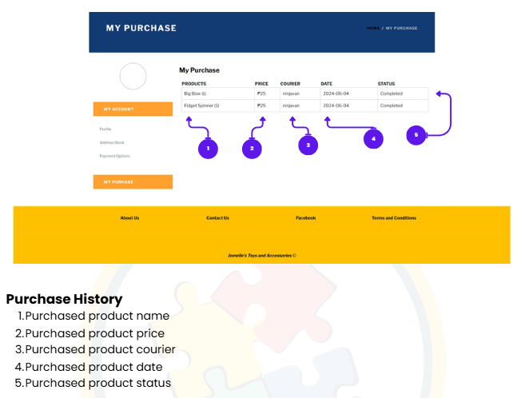

* **Financial Records:** Digital invoice generation for proof of purchase and business accounting.
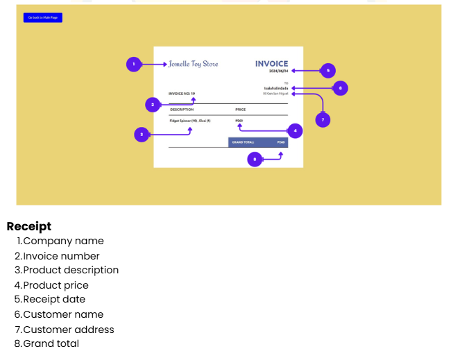

---
*Note: This manual is maintained by the development team. For technical support, please refer to the main repository README.*
